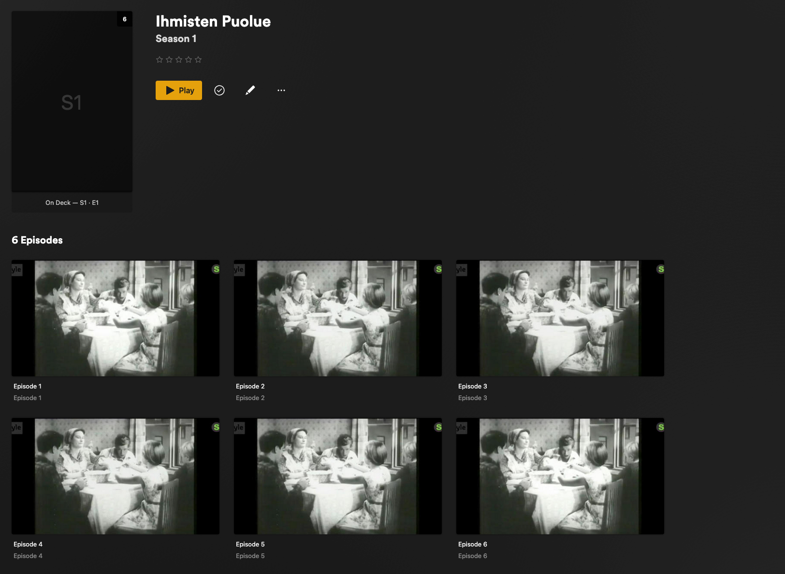
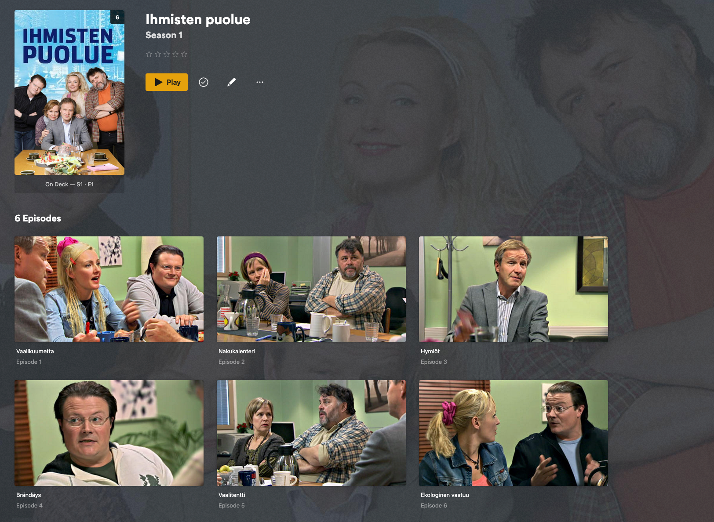

# yle-dl-plex

Download a TV series from [Yle Areena](https://areena.yle.fi/) and turn it
into a fully-furnished Plex library entry — with the proper series title,
plot, poster, fan-art background, transparent show-logo wordmark,
per-episode plots, air dates, runtimes and thumbnails — all stored as
offline NFO files that Plex picks up without ever touching the internet.

If you have a Plex server and you want a Yle series to sit on your shelf
next to your other content, this is the tool. It builds on
[`yle-dl`](https://github.com/aajanki/yle-dl) for the actual video
download and adds the Plex/Kodi metadata layer that `yle-dl` doesn't
provide.

## What it looks like in Plex

Without local metadata, Plex shows a Yle series as a generic-looking
folder with little more than the file names — no poster, no description,
no per-episode artwork.

After running `yle-dl-plex` and refreshing the library, the same series
has the correct title, plot summary, hero artwork, clearlogo wordmark,
and per-episode descriptions and thumbnails.

**Before**



**After**



## What it does

For a given Yle Areena series URL, `yle-dl-plex`:

1. Asks `yle-dl` for the list of episodes and their metadata.
2. Downloads each episode video to disk (skippable with `--metadata-only`).
3. Fetches the series' Areena page and extracts the series title, plot,
   poster, background image, and — when one is available — the
   transparent-PNG show logo (clearlogo wordmark).
4. Writes a `tvshow.nfo`, `poster.jpg`, `background.jpg` and (when
   present) `clearlogo.png` next to the season folders, plus a
   `<episode>.nfo` and `<episode>.jpg` next to every video.
5. Picks the high-resolution hero background image (the 16:9 one without
   the show title baked in) for `background.jpg`, so Plex's fan-art
   slot gets a clean image instead of one with a logo overlay.

The result is a directory tree that the Plex *Plex TV Series (NFO)* or
*Personal Media Shows* agent reads end-to-end — no Plex Pass, no online
metadata lookups, no manual entry.

The `clearlogo.png` is used by Plex's mobile and TV apps in place of a
plain text title — the typography matches the show's branding.

## Output layout

```
<destdir>/<series>/
  tvshow.nfo
  poster.jpg
  background.jpg
  clearlogo.png                  (optional — only when the show has a logo)
  Season 01/
    <series> - S01E01 - <title>.mkv
    <series> - S01E01 - <title>.nfo
    <series> - S01E01 - <title>.jpg
    ...
```

Specials that don't have a season + episode number (a one-off episode
inside an otherwise-seasoned show) are routed into a `Season 00/`
subfolder, the Plex/Kodi convention for specials:

```
<destdir>/<series>/
  Season 00/
    <series> - 2025-12-30 - SPESIAALI: Madrid.mkv
    <series> - 2025-12-30 - SPESIAALI: Madrid.nfo
    <series> - 2025-12-30 - SPESIAALI: Madrid.jpg
```

Date-only shows that never use season markers at all (think of a daily
news magazine) land every episode directly in `<series>/` with no season
subfolder.

## Requirements

- **Python 3.14** or newer.
- **`uv`** — see [installation
  instructions](https://docs.astral.sh/uv/getting-started/installation/).
- **`ffmpeg`** on `PATH` — `yle-dl` uses it to mux the downloaded
  streams.
- A working internet connection to Yle servers, and (for some content)
  a Finnish IP address. Yle's geo-restrictions are out of scope for this
  tool — if `yle-dl` itself can fetch the stream, so can we.

That's the full list. No Plex Pass, no API keys, no online metadata
account.

## Installing

```bash
git clone <this repo> yle-dl-plex
cd yle-dl-plex
uv sync
```

`uv sync` creates a virtual environment in `.venv/` and installs every
dependency including `yle-dl` and `ffmpeg`-aware download backends. The
console script `yle-dl-plex` is now runnable via `uv run`.

## Using it

The simplest run downloads a full series into the current directory.
The examples below use *Ihmisten Puolue*
(<https://areena.yle.fi/1-50363509>):

```bash
uv run yle-dl-plex https://areena.yle.fi/1-50363509
```

Pick an output directory — useful when you want the series to land
directly inside a Plex library:

```bash
uv run yle-dl-plex \
  --destdir "/Volumes/Media/TV Shows" \
  https://areena.yle.fi/1-50363509
```

Re-generate just the metadata for an already-downloaded series (no video
download, no risk of re-fetching gigabytes):

```bash
uv run yle-dl-plex --metadata-only \
  --destdir "/Volumes/Media/TV Shows" \
  https://areena.yle.fi/1-50363509
```

Download videos only, without NFO files (matches the behaviour of
`yle-dl` on its own):

```bash
uv run yle-dl-plex --skip-metadata \
  --destdir "/Volumes/Media/TV Shows" \
  https://areena.yle.fi/1-50363509
```

Verbose logging (shows every HTTP request and the upstream `yle-dl`
debug output):

```bash
uv run yle-dl-plex -v --destdir /tmp/test https://areena.yle.fi/1-50363509
```

You can pass either a **series URL** or an **individual episode URL**.
Both work; an episode URL still finds the parent series and downloads
the matching season's video into the right `Season XX/` subfolder.

## Configuring Plex to pick up the NFO

This is the easy step to get wrong. The **default** Plex *TV Series*
agent ignores `.nfo` files. To get the metadata produced by
`yle-dl-plex` to actually show up in Plex:

1. In Plex, open **Settings → Manage → Libraries**.
2. Edit the library that will hold the downloaded content (or create a
   new "TV Shows" library and add the destination folder to it).
3. Click **Advanced**.
4. Set **Agent** to **Plex TV Series (NFO)** or, if you prefer no
   internet metadata at all, **Personal Media Shows** with the NFO
   scanner.
5. Save, then **Scan Library Files**.

After the scan, the show should appear with its Areena title, plot,
poster, background and clearlogo. Per-episode descriptions, air dates,
and thumbnails follow.

If the show is missing artwork or shows generic icons, double-check the
agent setting — it's almost always the cause.

## What gets written

| File | What it contains |
|------|------------------|
| `tvshow.nfo` | Series title, plot, poster URL, studio (`Yle`), Yle program ID |
| `poster.jpg` | Series poster (portrait) |
| `background.jpg` | Series fan-art background (16:9, clean, up to 4K) |
| `clearlogo.png` | Transparent-PNG show wordmark, when the page exposes one (used by Plex mobile and TV apps in place of the text title) |
| `<episode>.nfo` | Episode title, season + episode number, plot, air date, runtime, thumbnail URL, studio, Yle program ID |
| `<episode>.jpg` | Episode thumbnail |

All NFOs are valid XML, properly escaped, and writeable in a single
atomic step (no half-written files if you cancel mid-run).

## Limitations and known quirks

- **Geo-blocked content.** Yle restricts most content to Finland;
  `yle-dl-plex` does not bypass that. If `yle-dl` can fetch the video
  from your location, this tool can too.
- **No subtitles file management.** `yle-dl` muxes subtitles into the
  `.mkv` directly; we don't write external `.srt` files. Plex still
  displays them from the muxed track.
- **Plex agent.** As stated above — without an NFO-capable agent, your
  library will look unchanged.
- **Specials without episode numbers** are placed into a `Season 00/`
  folder under the series root, matching the Plex/Kodi specials
  convention. Plex treats them as season-0 specials.
- **No clearlogo on some shows.** Not every Areena page advertises a
  transparent-PNG show logo. When none is present, `clearlogo.png` is
  skipped and Plex falls back to the text title.
- **Re-runs are cheap.** `yle-dl-plex` enables `yle-dl`'s resume mode,
  so already-downloaded files are skipped. NFO and artwork are always
  regenerated, so you can re-run after Areena updates a series'
  metadata and pick up the new description / poster.

## License

Author retains copyright; treat this repo as personal-use software
unless a separate `LICENSE` file says otherwise. `yle-dl` itself is
GPL-3-or-later; you accept those terms by depending on it.

## Acknowledgements

- [`yle-dl`](https://github.com/aajanki/yle-dl) by Antti Ajanki — the
  workhorse that does the actual stream extraction and download.
- The Plex and Kodi/XBMC communities for defining the NFO conventions
  this tool writes against.
